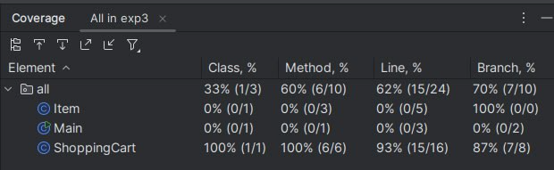
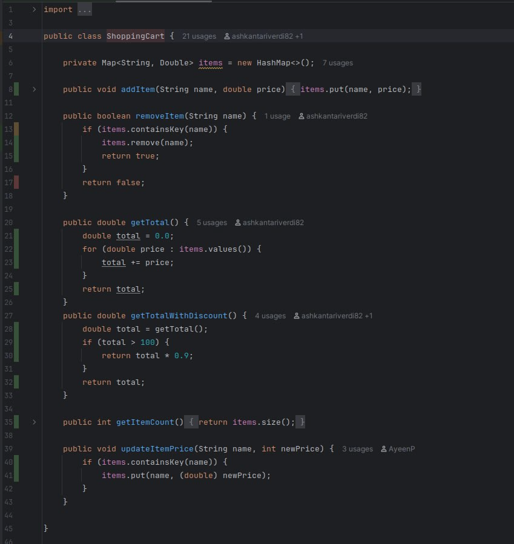
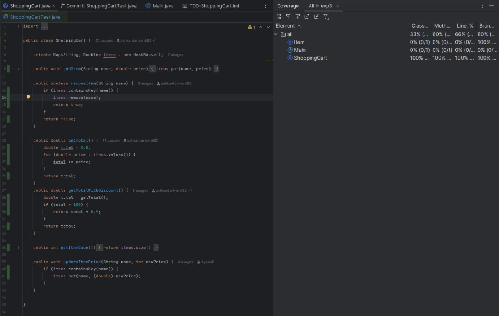

# آزمایش سوم - Test-Driven Development (TDD)

## گزارش آزمایش

این پروژه شامل پیاده‌سازی و تست سیستم سبد خرید (Shopping Cart) با استفاده از رویکرد Test-Driven Development است.

---

## بخش اول: کشف خطا

### تحلیل خطا

پس از بررسی کد اولیه، خطای زیر در متد `getTotalWithDiscount()` شناسایی شد:

**خطا:** در خط 29 فایل `ShoppingCart.java`، شرط اعمال تخفیف به صورت `if (total >= 100)` نوشته شده بود، در حالی که طبق مشخصات پروژه، تخفیف باید فقط زمانی اعمال شود که مجموع قیمت‌ها **بیشتر از 100** باشد ، نه برابر یا بیشتر از آن.

**کد مشکل‌دار:**
```java
public double getTotalWithDiscount() {
    double total = getTotal();
    if (total >= 100) {
        return total * 0.9;
    }
    return total;
}
```

**کد اصلاح شده:**
```java
public double getTotalWithDiscount() {
    double total = getTotal();
    if (total > 100) {
        return total * 0.9;
    }
    return total;
}
```

### پاسخ به پرسش اول

تست `testDiscountAtBoundary_WRONG()` انتظار دارد که وقتی مجموع قیمت‌ها دقیقا برابر 100 است، تخفیف 10% اعمال شود و نتیجه 90.0 برگردد. اما طبق مشخصات پروژه، تخفیف باید فقط برای مقادیر **بیشتر از 100** اعمال شود. بنابراین:

1. **خطای منطقی:** کد از `>=` استفاده می‌کرد که باعث می‌شد تخفیف در مجموع 100 نیز اعمال شود، در حالی که باید فقط برای مقادیر بیشتر از 100 اعمال شود.
2. **عدم تطابق با مشخصات:** تست انتظار داشت که در مجموع 100 تخفیف اعمال شود، اما مشخصات پروژه این را مجاز نمی‌داند.

### پاسخ به پرسش دوم

تست زیر برای کشف این خطا نوشته شد:

```java
@Test
public void testDiscountAtBoundary_corrected() {
    ShoppingCart cart = new ShoppingCart();
    cart.addItem("Item1", 50);
    cart.addItem("Item2", 50);

    double discounted = cart.getTotalWithDiscount();

    assertEquals(100.0, discounted);
}
```

این تست مشخص می‌کند که در مجموع دقیقا 100، نباید تخفیف اعمال شود و باید مقدار 100.0 برگردد.

### پاسخ به پرسش سوم

نوشتن آزمون پس از برنامه باعث می‌شود کد با قابلیت تست‌پذیری پایین طراحی شود و برنامه‌نویس دچار سوگیری تایید شده و ناخودآگاه آزمون‌ها را فقط برای اثبات درستی کد (نه یافتن باگ) بنویسد. همچنین این کار باعث می‌شود پوشش موارد لبه‌ای کاهش یافته و هزینه‌ی اصلاح خطاها به دلیل نیاز به بازنویسی بخش‌های اصلی بالا برود.


---

## بخش دوم: به‌کارگیری TDD

### مراحل پیاده‌سازی `updateItemPrice`

#### مرحله RED (قرمز)
سه تست مربوط به `updateItemPrice` از حالت کامنت خارج شدند:
1. `testUpdateItemPrice_ShouldChangePrice()` - بررسی تغییر قیمت
2. `testUpdateItemPrice_ShouldNotChangeCount()` - بررسی عدم تغییر تعداد آیتم‌ها
3. `testUpdateItemPrice_ItemNotFound_ShouldDoNothing()` - بررسی رفتار در صورت عدم وجود آیتم

در این مرحله، تست‌ها به دلیل خالی بودن متد `updateItemPrice` شکست خوردند.

#### مرحله GREEN (سبز)
متد `updateItemPrice` پیاده‌سازی شد:

```java
public void updateItemPrice(String name, int newPrice) {
    if (items.containsKey(name)) {
        items.put(name, (double) newPrice);
    }
}
```

پس از این پیاده‌سازی، تمام تست‌ها پاس شدند.

#### مرحله REFACTOR
کد پیاده‌سازی شده ساده و واضح بود و نیاز به بازسازی خاصی نداشت. با این حال، اطمینان حاصل شد که تمام تست‌های قبلی هنوز پاس می‌شوند.


### پاسخ به پرسش چهارم

نوشتن آزمون پیش از کدنویسی (TDD)، به دلایل زیر فرآیند ساخت برنامه را ساده‌تر می‌کند:

1. **درک بهتر مسئله**: قبل از شروع، مجبور می‌شوید جزئیات و خروجی‌های مطلوب را دقیقا مشخص کنید.

2. **طراحی بهینه**: فقط به اندازه‌ای کد می‌نویسید که نیاز است؛ این کار از پیچیدگی بیهوده جلوگیری می‌کند.

3. **عیب‌یابی سریع**: چون خطا بلافاصله پس از نوشتن چند خط کد ظاهر می‌شود، پیدا کردن منشا آن بسیار آسان است.

### پاسخ به پرسش پنجم

**مزایا:**
1. **کیفیت کد بالاتر:** نوشتن تست‌ها قبل از کد باعث می‌شود کد با کیفیت‌تر و قابل اعتمادتر باشد.
2. **طراحی بهتر:** TDD باعث می‌شود که کد از ابتدا قابل تست باشد و معماری بهتری داشته باشد.
3. **اطمینان از صحت:** تست‌ها به عنوان یک شبکه امنیت عمل می‌کنند و از بازگشت خطاها جلوگیری می‌کنند.
4. **مستندسازی:** تست‌ها به عنوان مستندات زنده رفتار سیستم عمل می‌کنند.
5. **اعتماد به نفس در تغییرات:** با وجود تست‌ها، می‌توان با اطمینان کد را تغییر داد.

**معایب:**
1. **زمان بیشتر:** نوشتن تست‌ها قبل از کد ممکن است در ابتدا زمان بیشتری بگیرد.
2. **منحنی یادگیری:** نیاز به یادگیری و تسلط بر ابزارهای تست دارد.
3. **تست‌های غیرضروری:** گاهی ممکن است تست‌های غیرضروری نوشته شوند.
4. **درک کامل نیازمندی‌ها:** برای نوشتن تست‌های مناسب، باید نیازمندی‌ها را به طور کامل درک کرد.


### پاسخ به پرسش ششم

#### گزارش پوشش تست (Test Coverage)


برای افزایش پوشش تست و پوشش دادن شرایط مرزی (edge cases)، تست‌های زیر اضافه شدند:

1. **تست‌های سبد خالی:**
   - `testEmptyCart_GetTotal()` - بررسی مجموع در سبد خالی
   - `testEmptyCart_GetItemCount()` - بررسی تعداد آیتم‌ها در سبد خالی
   - `testEmptyCart_RemoveItem()` - بررسی حذف از سبد خالی
   - `testEmptyCart_GetTotalWithDiscount()` - بررسی تخفیف در سبد خالی

2. **تست اضافه کردن آیتم با نام تکراری:**
   - `testAddItemWithSameName_ShouldOverwrite()` - بررسی اینکه اضافه کردن آیتم با نام تکراری قیمت را بازنویسی می‌کند

3. **تست‌های مرزی تخفیف:**
   - `testDiscountJustAbove100()` - بررسی تخفیف در مقدار کمی بیشتر از 100
   - `testDiscountJustBelow100()` - بررسی عدم اعمال تخفیف در مقدار کمی کمتر از 100

4. **تست عملیات چندگانه:**
   - `testMultipleItems_RemoveOne()` - بررسی حذف یک آیتم از چندین آیتم

5. **تست قیمت صفر:**
   - `testZeroPriceItem()` - بررسی آیتم با قیمت صفر
   - `testUpdatePriceToZero()` - بررسی به‌روزرسانی قیمت به صفر

6. **تست تخفیف با چندین آیتم:**
   - `testDiscountWithMultipleItems()` - بررسی اعمال تخفیف با چندین آیتم که مجموع آن‌ها بیشتر از 100 است

### گزارش پوشش تست

**قبل از افزودن تست‌های اضافی:**
همانطور که مشاهده می‌کنید، درصد پوشش کلاس ShoppingCart پیش از اضافه شدن تست‌های جدید برابر با ۸۷ ٪ است.

**پس از افزودن تست‌های اضافی:** طبق تصویر زیر، مقدار پوشش کلاس ShoppingCart به ۱۰۰٪ افزایش یافته است.


---

## ساختار پروژه

```
exp3/
├── src/
│   ├── ShoppingCart.java     
│   ├── Item.java             
│   └── Main.java
├── Test/
│   └── ShoppingCartTest.java
└── README.md
```

---